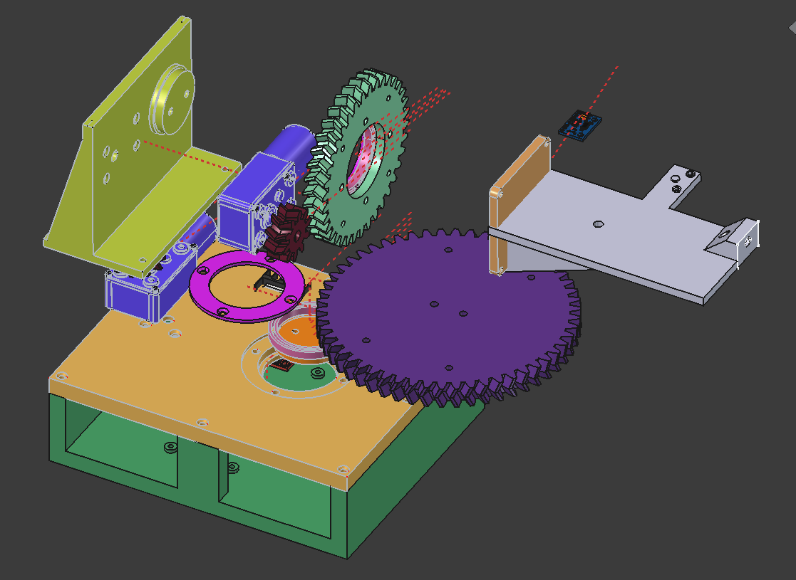
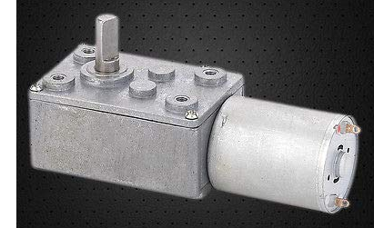
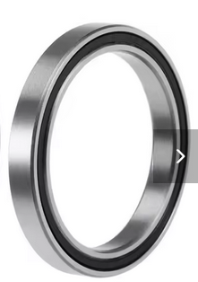
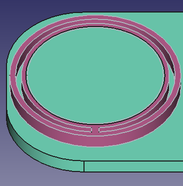
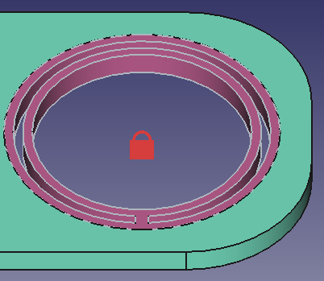

# Mostly 3D printed antenna tracker

Max 1 min for traversing 180o for azimuthal so around 6o/sec

## Parts
- 2x DC Motor Worm Gear Motor 

- DC motor driver 
- Main electric board 

- 2x 6707-2rs bearings

- 8 x M3x6 (I got a M3x10 and file it)
- 12 x M3x10
- 8 x M3x20
- 8 x M3 nut and washer
- 2x M3x6 Screw without Head  
- 2.5mm drill bit. Used to set the hole for the small_spur_gear_double_helix
- 12x M3 heat insert

# Tolerance
Print the part tolerance_test_print to test the tolerance of your 3D printer for the interal (VarSet.Base_bearing_inside_diameter_with_tolerance) and external (VarSet.Base_bearing_outside_diameter_with_tolerance) diameter of bearing. 
- Change the VarSet.Base_tolerance_outside_circle if the internal base for the bearing is need adjasment (VarSet.Base_bearing_inside_diameter_with_tolerance). 

- Change the VarSet.Base_tolerance_inside_circle if the exteral base of the bearing need adgasment (VarSet.Base_bearing_outside_diameter_with_tolerance).

# Software

Controling android: https://github.com/rt-bishop/Look4Sat/
 
## Firmware
Based on https://github.com/F4HTB/esp32Rotor
Calibrate the LSM303DLHC sensor: 
- https://www.sarcnet.org/mini-satellite-antenna-rotator-mk1.html -> Calibration Instructions
- https://www.youtube.com/watch?v=oJnpO5Nj7Gc

For Chania e4.87

# Caribration Jig

A calibration jig for the LSM303DLHC. 

## License

Copyright (c) 2024 Kostas Gompakis

Licensed under the MIT license.
