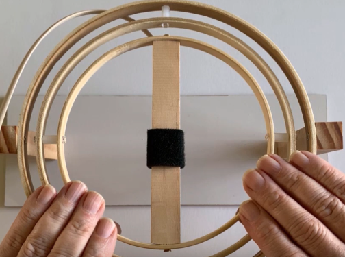

From https://www.youtube.com/watch?v=2W2W5A5Gk1E. Put tape over the buzzer, it will take 3-8min.

1. place sensor facing magnetic north x->

2. rough calibration  moving the sensor in 2 horizontal axis

3. Starting 12 calibration points: we point the front side of the sensor to a point halfway between the vertical and our local magnetic inclination and wait until sarc track stops beeping we then point the front side of the sensor vertically we search around that point until sarc track stops beeping

4. Point No1: the sensor verticaly and waiting till the beep ends. Move around 10o around the vertical 

5. Point No2: our local magnetic inclination. Mover around 10o on cerfucar on that point

6. Point No3-1: halfway between the vertical and our local magnetic inclination. Mover around 10o on cerfucar on that point

7. Point No4: Mover sensor verticaly. Mover around 10o on cerfucar on that point

8. Point No5: the top side of the sensor to our local magnetic inclination we search around that point until sarc track stops beeping

9. Point No5-2: pointing horizontaly until stop beeping

10. Point 6. we point the rear side of the sensor to a point halfway between the vertical and our local magnetic inclination 

11. Point 7: point the bottom side of the sensor to a point halfway between the vertical and our local magnetic inclination and wait until sarc track stops beeping

12. Point 7-1: point the sensor verticaly

13. Point 8: point the bottom side of the sensor to a our local magnetic inclination and wait until sarc track stops beeping

14. Point 9:  left side of the sensor to a point halfway between the 
vertical and our local magnetic inclination and wait until sarc track stops beeping

14. Point 9-2 :left side of the sensor verticaly

15. Point 10:  left side of the sensor to our local magnetic inclination and wait until sarc track stops beeping

16. Point 11:  right side of the sensor to a point halfway between the 
vertical and our local magnetic inclination and wait until sarc track stops beeping

17. Point 12:  right side of the sensor to our local magnetic inclination and wait until sarc track stops beeping
